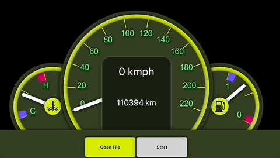

# QML Car Dashboard

Car dashboard simulator shows vehicle recorded trips.
Recorded trips are [available on an open database on Kaggle](https://www.kaggle.com/datasets/jaidalmotra/vehicle-speed-data/data).
The recorded trips have a column with vehicle speed during the trip.
The recorded data is used to draw a speed guage with the current vehicle speed on it.
You can choose any vehicle data to display.

## Steps to use

1. Clone the repository
1. Open in Qt Creator
1. Build the project
1. Run the QML preview
1. Load a compatible CSV file
1. Press start for trying the simulation

## References

- [Database](https://www.kaggle.com/datasets/jaidalmotra/vehicle-speed-data/data)